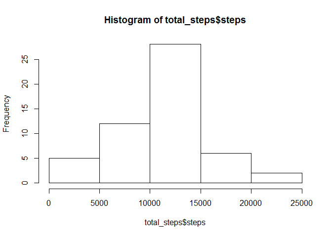

# Reproducible Research PA 1
MW  
Thursday, October 09, 2014  

### Loading and preprocessing the data:


```r
# The file "activity.csv" is required to be in the current working directory:
activity <- read.csv("activity.csv")
dim(activity)
```

```
## [1] 17568     3
```

```r
str(activity)
```

```
## 'data.frame':	17568 obs. of  3 variables:
##  $ steps   : int  NA NA NA NA NA NA NA NA NA NA ...
##  $ date    : Factor w/ 61 levels "2012-10-01","2012-10-02",..: 1 1 1 1 1 1 1 1 1 1 ...
##  $ interval: int  0 5 10 15 20 25 30 35 40 45 ...
```

```r
# preprocessing the data using the lubridate package
library(lubridate)

activity$date <- ymd(activity$date)
class(activity$date)
```

```
## [1] "POSIXct" "POSIXt"
```


### What is mean total number of steps taken per day?

For this part of the assignment, you can ignore the missing values in the dataset.

1. Make a histogram of the total number of steps taken each day

```r
total_steps <- aggregate(steps ~ date, data=activity, FUN=sum)
hist(total_steps$steps)
```

 

2. Calculate and report the mean and median total number of steps taken per day

```r
mean(total_steps$steps, na.rm=T)
```

```
## [1] 10766
```

```r
median(total_steps$steps, na.rm=T)
```

```
## [1] 10765
```


### What is the average daily activity pattern?

1. Make a time series plot (i.e. type = "l") of the 5-minute interval (x-axis) and the average number of steps taken, averaged across all days (y-axis)

```r
intervals <- split(activity, activity$interval)
steps_mean <- sapply(intervals, FUN=function(x) mean(x$steps, na.rm=T)) 
plot(names(steps_mean), steps_mean, type="l")
```

 


2. Which 5-minute interval, on average across all the days in the dataset, contains the maximum number of steps?

```r
which.max(steps_mean)
```

```
## 835 
## 104
```

```r
steps_mean[104]
```

```
##   835 
## 206.2
```


### Imputing missing values:

Note that there are a number of days/intervals where there are missing values (coded as NA). The presence of missing days may introduce bias into some calculations or summaries of the data.

1. Calculate and report the total number of missing values in the dataset (i.e. the total number of rows with NAs)

```r
row_isna <- apply(activity, MARGIN=1, FUN=function(x) any(is.na(x)))
sum(row_isna)
```

```
## [1] 2304
```

2. Devise a strategy for filling in all of the missing values in the dataset. The strategy does not need to be sophisticated. For example, you could use the mean/median for that day, or the mean for that 5-minute interval, etc.

```r
steps_list <- split(activity, activity$date)

# replacement for missing values: mean of steps (per interval) calculated accross all days
steps_repl <- lapply(steps_list, FUN=function(x){steps_mean[which(is.na(x$steps))]})
```


3. Create a new dataset that is equal to the original dataset but with the missing data filled in.


```r
steps_compl <- steps_list
for(i in 1:length(steps_compl)){
    steps_compl[[i]]$steps[which(is.na(steps_compl[[i]]$steps))] <- steps_repl[[i]]
}
```


4. Make a histogram of the total number of steps taken each day and Calculate and report the mean and median total number of steps taken per day. Do these values differ from the estimates from the first part of the assignment? What is the impact of imputing missing data on the estimates of the total daily number of steps?


```r
# histogram of new data (with missing values replaced):
activity_compl <- unsplit(steps_compl, activity$date)
total_steps_compl <- aggregate(steps ~ date, data=activity_compl, FUN=sum)
hist(total_steps_compl$steps)
```

 

```r
# old mean:
mean(total_steps$steps)
```

```
## [1] 10766
```

```r
#new mean:
mean(total_steps_compl$steps)
```

```
## [1] 10766
```

```r
# old median:
median(total_steps$steps)
```

```
## [1] 10765
```

```r
# new median:
median(total_steps_compl$steps)
```

```
## [1] 10766
```
Since the missing values were replaced by the mean of the existing values, the new mean does not differ. The median of the completed data set differs only slighty from the median of the original data.


### Are there differences in activity patterns between weekdays and weekends?

For this part the weekdays() function may be of some help here. Use the dataset with the filled-in missing values for this part.

1. Create a new factor variable in the dataset with two levels – “weekday” and “weekend” indicating whether a given date is a weekday or weekend day.


```r
wd <- weekdays(activity_compl$date, T)
daytype <- rep("weekday", nrow(activity_compl))
daytype[which(wd %in% c("Sa", "So"))] <- "weekend"
activity_compl$daytype <- factor(daytype)
summary(activity_compl$daytype)
```

```
## weekday weekend 
##   12960    4608
```


2. Make a panel plot containing a time series plot (i.e. type = "l") of the 5-minute interval (x-axis) and the average number of steps taken, averaged across all weekday days or weekend days (y-axis). The plot should look something like the following, which was creating using simulated data:


```r
library(ggplot2)

steps_mean_dt <- aggregate(steps ~ daytype + interval, data=activity_compl, FUN=mean)
str(steps_mean_dt)
```

```
## 'data.frame':	576 obs. of  3 variables:
##  $ daytype : Factor w/ 2 levels "weekday","weekend": 1 2 1 2 1 2 1 2 1 2 ...
##  $ interval: int  0 0 5 5 10 10 15 15 20 20 ...
##  $ steps   : num  2.2512 0.2146 0.4453 0.0425 0.1732 ...
```

```r
ggplot(steps_mean_dt, aes(x=interval, y=steps, col=daytype)) + geom_line() + facet_grid(daytype ~ .) + theme(legend.position="none")
```

 

